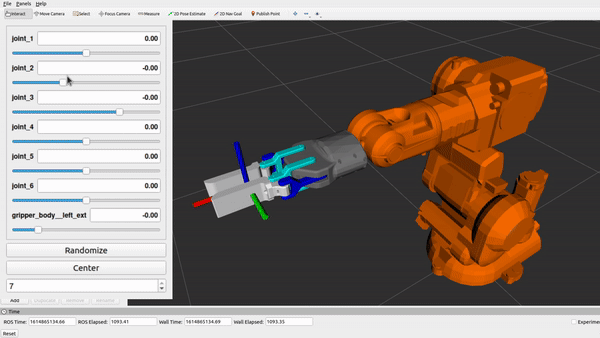

# ABB IRB140 ROS Simulation packages
This a set of ROS packages for simulating the ABB IRB140 robot, mainly for academic porpoises. Aimed to the students of Robotics in the the Universidad Nacional de Colombia.

Each package contains different functionalities, some of them require the use of the others packages, so its recommended to download or install all of them as a whole.

**Author:** Sebastian Realpe Rua, mainly for use in the robotics lab of Universidad Nacional de Colombia

# Installation
Firstly, you need ROS, follow the instructions in their official site [ros noetic installation](http://wiki.ros.org/noetic/Installation/Ubuntu). (ros-desktop-full is the recommended installation).

## Required ROS packages
The next are the required ROS packages for a proper execution of all the packages contained in this project. Just execute the command `sudo apt install <name_of_package>` and it will be automatically installed.
```
ros-noetic-desktop-full                     # basic ROS instance, needed for almost any ROS project
ros-noetic-gazebo-ros-control               # needed for controller simulation in Gazebo
ros-noetic-joint-state-controller           # required for proper robot simulation
ros-noetic-joint-state-publisher-gui        # plugin for publishing joint state values
ros-noetic-controller-manager               # package that implements virtual controllers for the simulated robot
ros-noetic-joint-trajectory-controller      # controller in charge of joint trajectory manipulation
ros-noetic-rqt-joint-trajectory-controller  # rqt plugin for publishing joint trajectory messages to the simulation controllers
ros-noetic-moveit                           # package for motion planning used both in simulated and real robot
ros-noetic-moveit-visual-tools              # moveit addon used for drawing the planned trajectories in RViz

```

Then, run the following commands in your `Ubuntu 20.04` terminal, assuming you already have a Catkin workspace.

```
cd ~/catkin_ws/src/
git clone -b noetic https://github.com/GitSRealpe/abb_irb140_ros_sim.git
cd ..
catkin_make
```

## Gazebo joint mimic plugin
The gripper design uses a parallel mechanism for the gripping action, so for a correct simulation in Gazebo a joint mimic plugin is needed, mostly because it enables an easy emulation of the joint mimic property native to ROS in the URDF description.

Currently this is the plugin used [roboticsgroup_upatras_gazebo_plugins](https://github.com/roboticsgroup/roboticsgroup_upatras_gazebo_plugins), it can be installed cloning the repo plugin in your catkin workspace with the folllowing command lines:
```
cd ~/catkin_ws/src/
git clone https://github.com/roboticsgroup/roboticsgroup_upatras_gazebo_plugins.git
cd ..
catkin_make
```
The plugin is already configured to the gripper description used in this project, for more indepth information you can access the [plugin repo](https://github.com/roboticsgroup/roboticsgroup_upatras_gazebo_plugins) directly.

## APC Gazebo props
Now the last step is downloading and *installing* the props or objects used in the Gazebo simulation for this specific project. The 3D models come from the [YCB Object and Model Set](https://www.ycbbenchmarks.com/object-models/) project, where their objective is to have 3D models of real life objects for research in grasping and robotics.

1. Download the modified model files from here: [modified model-set](https://www.mediafire.com/file/hojbtcs5x3st9fp/props.7z/file) (modified in the sense of SDF setup for Gazebo integration).
2. Its a compressed file (.7z format), Extract the folder `props` it in the following path `~/.gazebo` (assuming you have a default Gazebo installation).
3. Add this new model folder to the gazebo path execution by doing the following:
  - In a terminal run the command `gedit ~/.bashrc`.
  - At the very end of this file, copy and paste this:

    `export GAZEBO_MODEL_PATH=$GAZEBO_MODEL_PATH:~/.gazebo/props`
  - Save the changes to the file.
With this you should have all is needed for a correct simulation, to verify this, run Gazebo with the command `gazebo` in any terminal, and try to add the models you have *installed* to the world.


# Bringup and simulation
There are two options or environments to simulate the robot, RViz and Gazebo.
## RViz
The bringup in RViz offers a visualization of the robot description and its current state, be it just in simulation or the real robot.

Simply execute `roslaunch irb140_sim irb140_rviz.launch`, this will load the robot description in the ROS parameter server and it can be then visualized in the RViz gui with its current joint states, this will also execute the `joint-state-publisher-gui` so the joint angles can be set manually using sliders.

## Gazebo
Simply run `roslaunch irb140_sim irb140_gazebo.launch` to launch the robot description in the parameter server then simulate it in Gazebo, where the robot can interact with objects with simulated physics.

AQUI GIF DE Gazebo

The executed simulation has the robot with the designed gripper, positioned in the world origin of a custom Gazebo world

# Motion planning


**With the help from:**

https://github.com/FreddyMartinez/abb_irb140_support as a good starting point, helped to reduce initial setup work.
